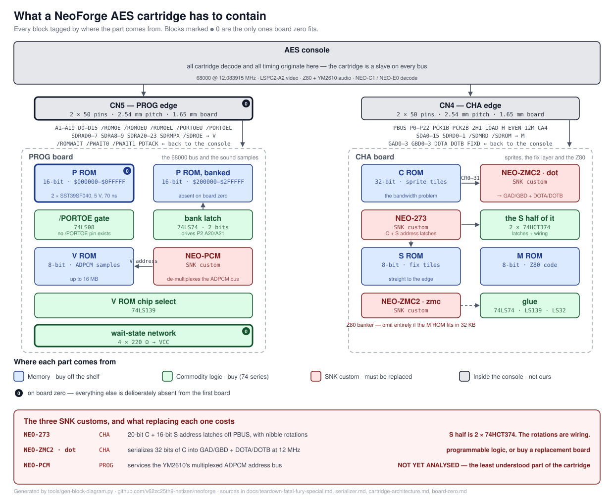

# What a NeoForge cartridge has to contain

A block diagram of an AES cartridge, with every block tagged by **where the part
comes from** rather than by what data flows through it. That is the question
this project actually has to answer, and a diagram that only showed data flow
would be prettier and less useful.

**This is a discussion document, not a specification.** It is drawn from what we
have read and measured so far, and the most valuable thing anyone can do with it
is tell us where it is wrong.

Generated by [`tools/gen-block-diagram.py`](../tools/gen-block-diagram.py) —
the chip list in that script is the single source of truth, so the picture
cannot drift from the list.

---

## The short version

A Neo Geo AES cartridge is **two boards, five memory regions, a handful of
74-series parts, and three SNK custom chips.** The memories and the 74-series
parts you can buy today. The three customs are the entire problem.

| | PROG | CHA |
|---|---|---|
| Memory | P (16-bit), V (8-bit) | C (32-bit), S (8-bit), M (8-bit) |
| Commodity logic | 74LS08, 74LS74, 74LS139 | 74LS74, 74LS139, 74LS32 |
| **SNK custom** | **NEO-PCM** | **NEO-273**, **NEO-ZMC2** |

`[MEASURED: teardown of a Fatal Fury Special AES cartridge, 2026-09-21]` — see
[`teardown-fatal-fury-special.md`](teardown-fatal-fury-special.md).

## The three customs, in order of how much we understand them

### NEO-273 — understood, and partly solved

Two banks of edge-triggered latches: 20 bits of C address on `PCK1B`, 16 bits of
S address on `PCK2B`, each with a nibble rotation that is **pure wiring, not
logic**. `[VERIFIED: NeoGeoFPGA-sim neo_273.v]`

**The S half is two 74HCT374s.** That is not a guess, it falls straight out of
the register widths. The C half is 20 bits, so three more of the same part,
which suggests the whole chip might be five octal latches and some track
routing. **We have not checked that, and it is the first thing we would like
someone to shoot down** — if NEO-273 does anything on the C side beyond latching,
that changes the bill of materials for every board past board zero.

### NEO-ZMC2 — understood, not solved

Two unrelated blocks in one package `[VERIFIED: NeoGeoFPGA-sim neo_zmc2.v]`:

- **`zmc2_dot`** takes 32 bits of C data and emits `GAD0-3`, `GBD0-3`, `DOTA`
  and `DOTB` at 12 MHz. This is the real work, and it needs programmable logic
  or a replacement board.
- **`zmc2_zmc`** banks the Z80's M ROM. **Omit it entirely if the M ROM fits in
  32 KB**, which any reasonable sound driver does.

[`serializer.md`](serializer.md) has the full analysis, derived from simulation
and checked with self-checking testbenches. No datasheet for this part is
public.

### NEO-PCM — not analysed at all

**This is the gap.** The PROG board carries a chip marked `SNK CORP PCM`, and
[`cartridge-architecture.md`](cartridge-architecture.md) has carried the open
question *"How does the YM2610's independent ADPCM address bus get serviced?"*
without an answer. The connector gives the cartridge `SDRAD0-7`, `SDRA8-9`,
`SDRA20-23`, `SDRMPX` and `/SDROE` — a **multiplexed** address bus — and
somewhere on the board that has to become a flat address into the V ROM.

We believe NEO-PCM is what does it. We have not traced it, simulated it, or
found documentation for it. **Drawing this diagram is what made it obvious that
it is the least understood part of the cartridge**, which is a reasonable
argument for drawing diagrams.

## What board zero fits, and what it leaves out

Four blocks, marked on the diagram: the PROG card edge, the fixed P ROM, the
wait-state network, and nothing else. No banked P, no V, no CHA board, **no
custom chips and no level translation** — see
[`board-zero.md`](board-zero.md) for why that is possible at all and what it
costs in margin.

The point of board zero is that it can only fail for one reason. Everything on
this diagram that it omits is something that could otherwise have been the cause.

## Things we would like to be corrected on

1. **Is NEO-273 really just five octal latches plus routing?**
2. **What does NEO-PCM actually do**, and is there a 74-series equivalent?
3. **Is the C ROM bandwidth achievable with modern parallel flash**, or does it
   force the shadow-into-RAM architecture that
   [`open-questions.md`](open-questions.md) Q4 argues a 2026 commercial cart is
   already using?
4. **Does the PROG board shown bank at all?** The Fatal Fury Special PROG board
   carries 74LS08, LS32 and LS139 but **no LS74**, while
   [`prom-banking.md`](prom-banking.md) describes PROGBK1 banking with one. That
   board holds 1.5 MB of P, which needs a bank. Something is doing it, and we do
   not know what.

Open an issue, or correct us anywhere. Everything in this repository carries an
evidence tag saying how strongly it is held — `[VERIFIED]`, `[MEASURED]`,
`[ANECDOTAL]`, `[UNVERIFIED]` — and the weak ones are listed first in
[`evidence-index.md`](evidence-index.md) precisely so they are easy to attack.
